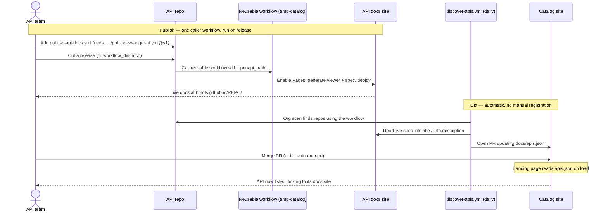

# HMCTS API Catalog

A central index of published HMCTS API documentation. The catalog is a single
static page that lists every participating API and links to its rendered
Swagger UI documentation and source repository.

**Live catalog:** https://hmcts.github.io/amp-catalog/

This is the central-index half of the GitHub Pages stop-gap described in
[Migrating from API Hub](https://tools.hmcts.net/confluence/spaces/AMP/pages/1973306073/Migrating+from+API+Hub).
Each API hosts its **own** documentation site at `https://hmcts.github.io/<repo>/`;
this repo just lists them.

It is explicitly a **bridge, not the destination**. When the
[APIM Developer Portal](https://tools.hmcts.net/confluence/spaces/AMP/pages/1973304611/Publishing+existing+API+spec+to+Developer+Portal)
lands, the catalog index is re-pointed at portal URLs and the per-repo Pages
sites are retired.

## How it works

```
  api-cp-crime-echo ─┐                                          (each repo adds ONE
  api-cp-...-hrds   ─┤ uses: hmcts/amp-catalog/                  caller workflow)
  api-cp-...        ─┘   .github/workflows/publish-swagger-ui.yml@v1
        │                          │
        │ reusable workflow runs   ▼
        │ in the caller's context, deploys to
        └────────────────────► hmcts.github.io/<repo>/          (its own Swagger UI)
                                       ▲
   daily discover-apis.yml ───────────┘ scans org, reads each live spec
        │ opens PR updating apis.json
        ▼
  amp-catalog ─────────────────► hmcts.github.io/amp-catalog/   (this index)
```

- Each API repo publishes its **own** documentation site (default
  `GITHUB_TOKEN`, no cross-repo secrets) — but the publish *logic* lives once in
  this repo's reusable workflow, so a repo's whole footprint is one ~12-line
  caller.
- `amp-catalog` holds the reusable publish workflow, a registry
  (`docs/apis.json`), the discovery job that keeps it current, and a static
  landing page that renders it.

---

## How to list your API in the catalog

There is **one step** for an API team, plus the listing happens automatically.

### Fast path — the Claude Code skill (recommended)

If you use Claude Code, the `publish-api-to-catalog` skill does the whole thing
for you: it finds your spec, runs a public-exposure eligibility check, adds the
caller workflow, opens the PR, and verifies the live site and catalog listing.

1. **Install the skill once** (makes it available in any repo):
   ```bash
   mkdir -p ~/.claude/skills
   # from a checkout of this repo:
   cp -r amp-catalog/.claude/skills/publish-api-to-catalog ~/.claude/skills/
   # or copy it straight from GitHub:
   #   gh repo clone hmcts/amp-catalog -- --depth 1 \
   #     && cp -r amp-catalog/.claude/skills/publish-api-to-catalog ~/.claude/skills/
   ```
2. **Run Claude Code from inside your API repo** and invoke it:
   ```
   /publish-api-to-catalog
   ```
   or just ask: *"publish this API to the catalog"*.
3. Answer the eligibility prompt (the skill will not publish an internal-only
   API), then let it open the PR and verify the result.

> The skill is the optional fast path. The manual steps below are the source of
> truth and work without Claude Code.

### Add one workflow to your API repo

Drop this single file into your repo. That's the entire footprint — no viewer
HTML, no Pages setup, no edits to your existing CI:

```yaml
# .github/workflows/publish-api-docs.yml
name: Publish API docs
on:
  release:
    types: [ published ]
  workflow_dispatch:
permissions:
  contents: read
  pages: write
  id-token: write
jobs:
  docs:
    uses: hmcts/amp-catalog/.github/workflows/publish-swagger-ui.yml@v1
    with:
      openapi_path: src/main/resources/openapi/openapi-spec.yml
```

The shared workflow enables GitHub Pages, generates the Swagger UI viewer
(Try-It disabled), and deploys your spec to `https://hmcts.github.io/<repo>/`.
Cut a release (or run it via *workflow_dispatch*) to publish.

> Pin to a released tag (`@v1`), not `@main`, so a change to the shared
> workflow can't break your repo unexpectedly.

### Listing is automatic

A daily job in this repo
([`discover-apis.yml`](.github/workflows/discover-apis.yml)) scans the org for
repos using the workflow above, reads each live spec's `info.title` /
`info.description`, derives the team from your `CODEOWNERS`, and opens a PR
updating [`docs/apis.json`](docs/apis.json). Once that merges your API appears
in the catalog. You don't have to register anything by hand.

> **Want it listed immediately, or need to override the auto-derived
> title/description/team?** Edit [`docs/apis.json`](docs/apis.json) directly and
> open a PR. The **Validate API catalog** workflow checks it (valid JSON,
> required fields, no duplicate names). Manual entries use the same fields:
> `name` (repo name — required), `title`, `description`, `team`, and optional
> `docs` / `repo` URL overrides.

### Sequence



## Registry schema

`docs/apis.json`:

```json
{
  "apis": [
    {
      "name": "api-cp-crime-echo",      // required — GitHub repo name
      "title": "Crime Echo API",        // required — display name
      "description": "One-liner.",       // required — shown in the list
      "team": "Case Admin",              // required — owning team
      "docs": "https://…",               // optional — overrides derived docs URL
      "repo": "https://…"                // optional — overrides derived repo URL
    }
  ]
}
```

Derived when not overridden:
- docs → `https://hmcts.github.io/<name>/`
- repo → `https://github.com/hmcts/<name>`

## Scope

**In scope:** external (bucket 2c) and external-with-mock (2b, docs-only here)
APIs — anything safe to expose publicly, since GitHub Pages on a public repo is
world-readable.

**Out of scope:** internal-only APIs (bucket 2a). GitHub Pages cannot enforce
signed-in-only access without GitHub Enterprise, so internal APIs stay on API
Hub until the Developer Portal lands.

## Operational notes

- **Discovery token:** `discover-apis.yml` needs a repo secret
  `CATALOG_DISCOVERY_TOKEN` with org repo-read + code-search access — the
  default `GITHUB_TOKEN` cannot search across other repos. Without it the daily
  job fails; manual `docs/apis.json` edits still work.
- **Team derivation** is best-effort (first `@org/team` in the discovered repo's
  `CODEOWNERS`, else `TBD`). Override by editing the entry directly.
- **Discovery is additive:** it adds newly-published APIs (those with a live
  Pages site) and never overwrites or removes existing entries — so curated
  edits stick and a transient fetch failure can't drop a live API. Remove an API
  by editing `docs/apis.json` by hand.

## Future enhancements (not built)

- **Version awareness:** surface the latest published version per API.
- **Retirement path:** swap derived docs URLs for Developer Portal URLs in one
  place once the portal is live.
