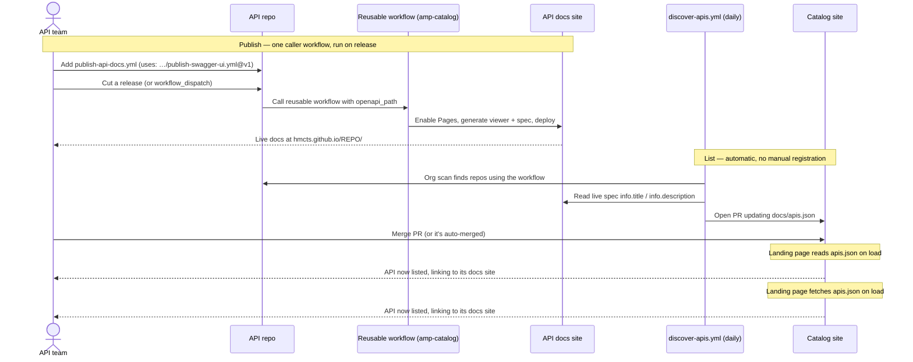

# API Catalog — design & plan

## Purpose

Provide a single place to discover published HMCTS APIs while the strategic
[APIM Developer Portal](https://tools.hmcts.net/confluence/spaces/AMP/pages/1973304611/Publishing+existing+API+spec+to+Developer+Portal)
is being built. This catalog is the **central-index** component of the GitHub
Pages stop-gap proposed in
[Migrating from API Hub](https://tools.hmcts.net/confluence/spaces/AMP/pages/1973306073/Migrating+from+API+Hub).

It is explicitly a **bridge, not the destination**. When the Developer Portal
lands, the catalog index is re-pointed at portal URLs and the per-repo Pages
sites are retired.

## Topology (per-repo model)

```
  api-cp-crime-echo ─┐                                          (each repo adds ONE
  api-cp-...-hrds   ─┤ uses: hmcts/amp-catalog/                  caller workflow)
  api-cp-...        ─┘   .github/workflows/publish-swagger-ui.yml@v1
        │                          │
        │ reusable workflow runs   ▼
        │ in the caller's context, deploys to
        └────────────────────► hmcts.github.io/<repo>/          (its own Swagger UI)
                                       ▲
   daily discover-apis.yml ───────────┘ scans org, reads each live spec
        │ opens PR updating apis.json
        ▼
  amp-catalog ─────────────────► hmcts.github.io/amp-catalog/   (this index)
```

- Each API repo still publishes its **own** documentation site (default
  `GITHUB_TOKEN`, no cross-repo secrets) — but the *logic* lives once in this
  repo's reusable workflow. A repo's whole footprint is one ~12-line caller.
- `amp-catalog` holds the reusable publish workflow, a registry
  (`docs/apis.json`), the discovery job that keeps it current, and a static
  landing page that renders it.

### Why this shape

| Decision | Rationale |
| --- | --- |
| Per-repo docs sites (not centralised hosting) | Avoids cross-repo write auth in ~16 repos; each repo publishes itself. |
| Reusable workflow hosted once | API repos add one caller file; the viewer/Pages/deploy logic is maintained in one place. |
| Pin callers to `@v1` | A bad change to the shared workflow can't silently break every repo. |
| Auto-discovery into `docs/apis.json` | API teams don't register by hand; the daily scan reconciles the list. |
| Client-side rendering | Landing page `fetch`es `apis.json` — zero build step; merge = live. |
| Validation workflow | Keeps any manual edits to the registry well-formed. |

## How listing works

1. **Publish:** the API repo adds the one-line caller workflow
   (`uses: hmcts/amp-catalog/.github/workflows/publish-swagger-ui.yml@v1`). On
   release it deploys the repo's Swagger UI to `https://hmcts.github.io/<repo>/`.
   The shared workflow enables Pages and generates the viewer — nothing else is
   needed in the repo.
2. **Discover:** `discover-apis.yml` runs daily, finds repos using the workflow,
   reads each live spec's `info.title` / `info.description`, derives the team
   from `CODEOWNERS`, and opens a PR updating `docs/apis.json`.
3. **Publish the index:** on merge, the landing page (which reads `apis.json` at
   load time) lists the API.

Teams who want an entry immediately, or need to override the auto-derived
fields, can edit `docs/apis.json` directly; `validate-catalog.yml` checks it.

See [README.md](../README.md) for the contributor guide.

## Sequence — adding an API to the catalog



## Registry schema

`docs/apis.json`:

```json
{
  "apis": [
    {
      "name": "api-cp-crime-echo",      // required — GitHub repo name
      "title": "Crime Echo API",        // required — display name
      "description": "One-liner.",       // required — shown in the list
      "team": "Case Admin",              // required — owning team
      "docs": "https://…",               // optional — overrides derived docs URL
      "repo": "https://…"                // optional — overrides derived repo URL
    }
  ]
}
```

Derived when not overridden:
- docs → `https://hmcts.github.io/<name>/`
- repo → `https://github.com/hmcts/<name>`

## Scope

**In scope:** external (bucket 2c) and external-with-mock (2b, docs-only here)
APIs — anything safe to expose publicly, since GitHub Pages on a public repo is
world-readable.

**Out of scope:** internal-only APIs (bucket 2a). GitHub Pages cannot enforce
signed-in-only access without GitHub Enterprise, so internal APIs stay on API
Hub until the Developer Portal lands.

## Operational notes

- **Discovery token:** `discover-apis.yml` needs a repo secret
  `CATALOG_DISCOVERY_TOKEN` with org repo-read + code-search access — the
  default `GITHUB_TOKEN` cannot search across other repos. Without it the daily
  job fails; manual `docs/apis.json` edits still work.
- **Team derivation** is best-effort (first `@org/team` in the discovered repo's
  `CODEOWNERS`, else `TBD`). Override by editing the entry directly.

## Future enhancements (not built)

- **Version awareness:** surface the latest published version per API.
- **Retirement path:** swap derived docs URLs for Developer Portal URLs in one
  place once the portal is live.
